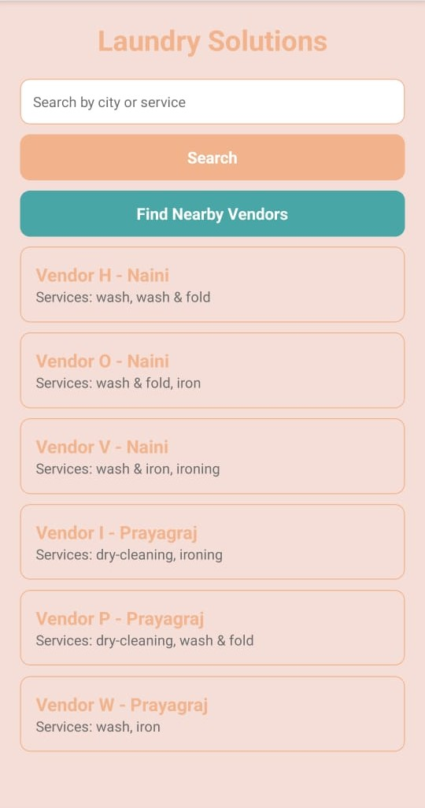
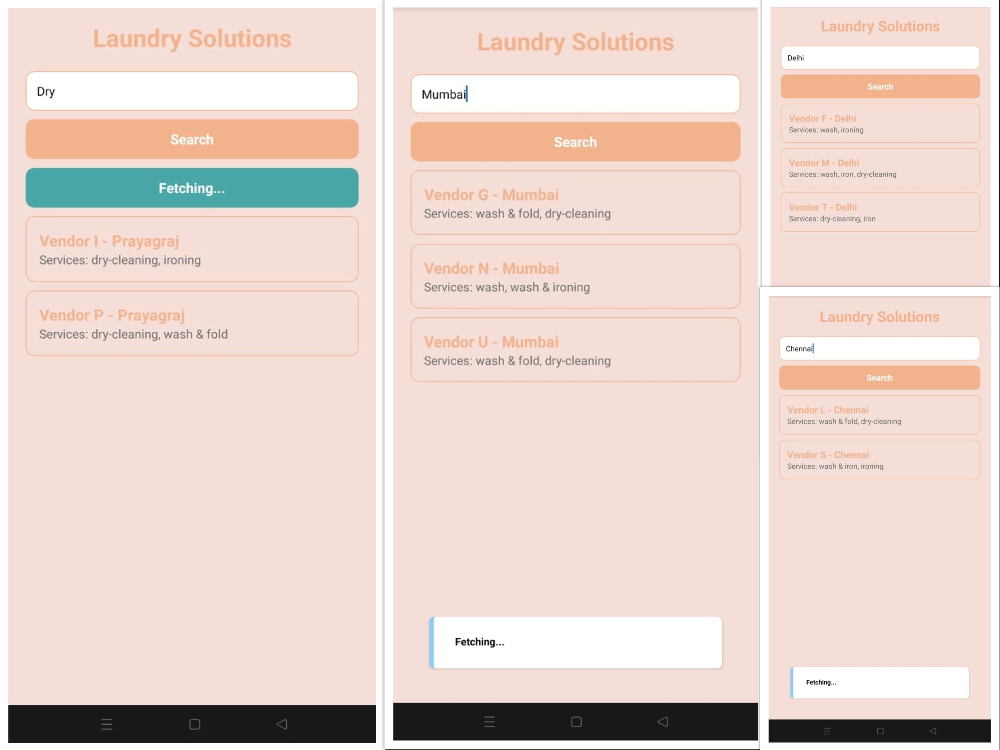

# My Android App

## Screenshots

### Home Screen

### Search Feature

# Laundry Vendor Finder App  

This is a **React Native Android application** with a **Node.js + MySQL backend** that connects customers with laundry vendors based on location and services.  

## 📌 Features  

- **Vendor Listings**: Vendors are registered with location details (latitude/longitude) and services offered.  
- **Customer Search**:  
  - Customers can find vendors **near them** based on their current location.  
  - Customers can search for vendors offering a **specific service** in a chosen city.  
- **Service-Based Filtering**: Users can filter vendors by laundry services like **wash, wash & fold, dry-cleaning, ironing, wash & ironing**, etc.  
- **Location-Based Search**: Customers in **Hyderabad, Bangalore, Chennai, Mumbai, Delhi** (or any registered city) can find vendors in their area.  

## 🛠 Tech Stack  

- **Frontend**: React Native (Android)  
- **Backend**: Node.js (Express.js)  
- **Database**: MySQL  

This project aims to provide an easy-to-use **laundry service finder** for users while helping vendors reach a wider audience. 🚀  

👉 **Stay tuned for development updates!**
